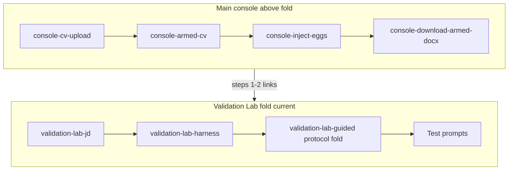

# Coherent Validation Lab: inject → harness → try in AI

## Decisions (locked)

1. **Layout (historical):** This plan shipped protocol-first; product later moved to **harness-first** (JD → harness → guided protocol in a nested fold → prompts). Anchors unchanged: `#validation-lab`, `#validation-lab-guided`, `#validation-lab-jd`, `#validation-lab-harness`.
2. **Same-page links:** [`protocolStepRichText.tsx`](frontend/src/lib/protocolStepRichText.tsx) renders `[label](#id)` and `[label](/#id)` in-page (no `target=_blank`); `https?` links unchanged. IDs must match `[a-zA-Z][a-zA-Z0-9_-]*`.
3. **Console anchors:** `console-cv-upload`, `console-armed-cv`, `console-inject-eggs`, `console-download-armed-docx` on [`page.tsx`](frontend/app/page.tsx).
4. **File default:** After successful harden, `labHardenedDocxFile` = `File` from in-memory blob; active file = `pickFile ?? hardenedOutput ?? consoleSelected`. Copy keys `labHarnessSourcePicked` / `labHarnessSourceHardenedOutput` / `labHarnessSourceConsoleSelection`.
5. **No** `docs/API.md` change (no API contract change).

## Target layout (implemented)

## References

- Protocol + harness copy: [`security.ts`](frontend/src/copy/security.ts), [`hr.ts`](frontend/src/copy/hr.ts) — single coordinated edit surface for `validationLabManualMirrorProtocol`.
- Parser tests: [`validationLabProtocol.test.ts`](frontend/src/lib/validationLabProtocol.test.ts).

## Non-goals (unchanged)

- No change to lab API routes or `labCompleteEnabled` behavior.
- PDF / Phase E deferred.
