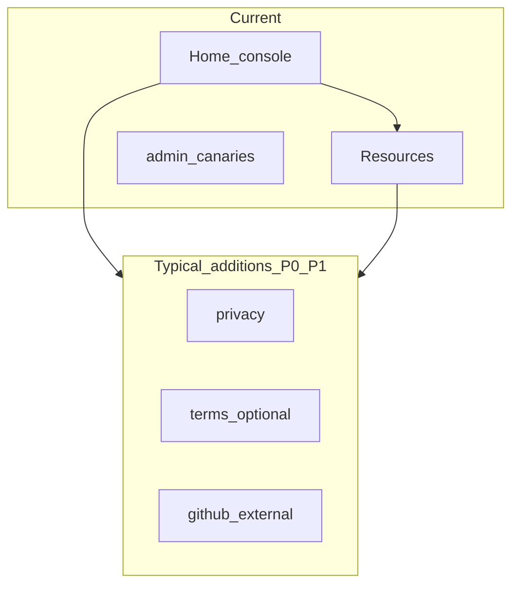

# Credibility & information architecture — research brief

**Date:** 2026-03-20  
**Scope:** Research deliverable for the **Credibility gap research** plan (stakeholder plan lives in Cursor; may not be in-repo). **Not** an implementation spec.  
**Method:** Codebase and doc trace, desk heuristic review, competitive desk research, optional user-interview **protocol** (live sessions not run in this pass).

---

## 1. Executive summary

FunversarialCV ships **strong in-flow trust mechanics** (PII dehydration narrative, audience modes, long-form Resources). The gap to a “credible product surface” is mostly **positioning and product chrome**: the home console still **names itself as an experiment** (`RUN THE CV EXPERIMENT`), uses **lab vocabulary** (eggs, Validation Lab, Duality Monitor / pipeline stages, terminal log), and lacks **standard product affordances** (footer with legal/analytics disclosure, About/FAQ, status, curated SEO metadata). HR copy is softer than Security copy but **still shares the experiment label and monospace/uppercase affordances** in key places.

**Recommendation at a glance:** Treat “credibility” as **structural** (IA, policies, metadata, operational signals) and keep **playful depth** inside Security mode or secondary panels—without conflating the two in the first five seconds.

---

## 2. Target posture (stakeholder decision — not assumed)

Pick one primary posture for vNext; the backlog below is tagged by which posture it supports.

| Posture | Fit | Trade-off |
|--------|-----|-----------|
| **A — Serious dual-audience utility** | Default recommendation from this research | HR path needs less “lab” chrome; Security keeps depth. |
| **B — Public red-team lab** | Matches current voice (“experiment,” “console”) | Explicit disclaimers + minimal “enterprise” expectations; still add legal/analytics transparency. |
| **C — Marketing site + app shell** | Maximum “real company” feel | Higher build cost: landing, pricing (if any), careers, etc. |

**Proposed working posture (for planning):** **A** — *Serious B2C/B2B-style utility with an optional Security “pro” skin*, with Resources as the long-form trust layer until dedicated policy routes exist.

---

## 3. Workstream 1 — Heuristic & IA audit

### 3.1 Information architecture (routes)

| Route | Purpose |
|-------|---------|
| `/` | Main console: upload, sample CVs, engine config, success/download, Validation Lab, Duality Monitor ([`frontend/app/page.tsx`](../frontend/app/page.tsx)) |
| `/resources` | Long-form usage, privacy flow, OWASP links ([`frontend/app/resources/page.tsx`](../frontend/app/resources/page.tsx)) |
| `/admin/canaries` | Admin/specialized (not part of mainstream “product” IA) |

**Not present (typical product gaps):** dedicated Privacy / Terms / Contact / Security disclosure routes, FAQ, Changelog, Status/health, About/Product story, GitHub link in chrome (may exist only off-site).

### 3.2 Home page section order (primary column)

1. Optional **intro** (Security has adversarial framing; HR is shorter)  
2. Collapsible **“How to run a fair test”** → `ExperimentFlowPanelBody` (steps + `experimentFlowLabel`)  
3. **Upload** group: `DropZone`, max size hint, sample CV collapsible  
4. `
` **privacy / PII** expansion  
5. **Engine configuration** (egg cards, preserve styles, primary CTA)  
6. **Validation Lab**  
7. **Duality Monitor** (toggle + log)

**Implication:** The **first structural landmark after the header is still “experiment flow,”** even when collapsed—so scanners of the page (humans and SEO) see “experiment” before “upload” in the DOM order.

### 3.3 Global chrome

- [`frontend/app/layout.tsx`](../frontend/app/layout.tsx): Skip link, `JetBrains_Mono` on **entire** `<body>`, no footer, no legal links, no analytics notice.
- [`frontend/src/components/SiteChrome.tsx`](../frontend/src/components/SiteChrome.tsx): Brand H1 + tagline + single secondary nav link (Resources / Back home); top bar = PII badge + audience switcher.

**Cross-check with** [`docs/UX_UI_REVIEW.md`](UX_UI_REVIEW.md): Follow-ups (skip link click vs `<main>`, `/api/eggs` loading fallback, oversize message numeric limit) remain **maturity/polish** items that affect perceived production quality.

### 3.4 Desk “five-second” impression (internal, not user-validated)

**Prompt:** *What is this and who is it for?*

| Reader | Likely first read |
|--------|-------------------|
| Skim-only | “Funversarial” + gradient title + monospace badge → **hacker / demo tool** |
| HR mode | Softer tagline but **same experiment label** in collapsible + uppercase section rails → **mixed: edu tool, not HR SaaS** |
| Security mode | “Adversarial,” “console,” “Duality Monitor” → **legit lab / red team** (credible for that niche, not “generic product”) |

**Gap:** No single **plain-product sentence** above the fold that reads like a normal SaaS value prop without opening Resources.

### 3.5 Terminology matrix (prominent strings)

Legend: **HR-OK** = appropriate for recruiter-facing mode; **Lab** = fine for Security or deep panels; **Split** = consider context-specific wording.

| Term / pattern | HR copy | Security copy | Notes |
|----------------|---------|----------------|--------|
| `experimentFlowLabel` “RUN THE CV EXPERIMENT” | **Lab** | **Lab** | Same in both [`hr.ts`](../frontend/src/copy/hr.ts) / [`security.ts`](../frontend/src/copy/security.ts)—primary credibility clash for HR. |
| “Eggs” / egg names | HR uses “options” in several places; Resources still “easter eggs” | “Eggs” everywhere | HR **partially** de-jargonized; engine section title HR: “Options to add”. |
| “Harden” vs “Add signals” | Add signals | Harden | Good split. |
| “Duality Monitor” vs “Processing steps” | Processing steps | Duality Monitor | Good split. |
| “Validation Lab” | Same | Same | Sounds like a **classroom**; HR might use “Try in an AI tool” or similar. |
| “Pipeline / Engine / Terminal log” | Processing steps / log | Pipeline / Terminal | HR reduced; still **terminal** metaphor in `terminalLogTitle`. |
| “Armed CV” (security) | “CV loaded” | Armed CV | Good split. |
| Uppercase micro-labels (`tracking-[0.2em]`) | Present on input + engine rails | Present | Contributes to **instrument panel** feel in HR mode. |
| Sample **Clean / Dirty** | Framed as learning | “Adversarial sample” | HR: OK with context; still **game-like** labels. |

---

## 4. Workstream 2 — Competitive & analog benchmarking

Desk research only; use these as **pattern libraries**, not design copies.

### 4.1 Adjacent security / OSS-style products (depth & trust)

| Analog | What signals “real product” | Takeaway for FunversarialCV |
|--------|-----------------------------|-----------------------------|
| [Semgrep](https://semgrep.dev/) | Product marketing + **Docs** + **Security** pages + **Trust portal** ([trust.semgrep.dev](https://trust.semgrep.dev/)) + terms | Separate **trust surface** from the tool UI; link SOC2-style artifacts only if applicable. |
| [Semgrep Docs — Security](https://semgrep.dev/docs/security) | Vulnerability reporting contact, explicit security program | Add **security@** or GitHub security path in footer + Resources. |
| [OWASP](https://owasp.org/) (reference) | Neutral nonprofit IA, clear “about” and project boundaries | You already cite OWASP; **your** site still needs **your** policies. |

### 4.2 Document / privacy-forward consumer tools (upload fear + legal IA)

| Analog | What signals “real product” | Takeaway for FunversarialCV |
|--------|-----------------------------|-----------------------------|
| [1Password Legal Center](https://1password.com/legal) | **Legal hub** with privacy, terms, history, accessibility | Minimal v1: **one Privacy page** + optional Terms stub + version date. |
| [1Password — privacy overview](https://1password.com/privacy) | Plain-language principles before legalese | Short “how we handle data” page mirrors your Resources but **linkable and shareable**. |

### 4.3 Synthesis — patterns to borrow

1. **Footer legal cluster** (Privacy, Terms if needed, GitHub, Security contact).  
2. **Dedicated trust/privacy URL** users can send to compliance—not only `/resources` scroll.  
3. **Product metadata** (title, description, OG) for link previews.  
4. **Optional** trust center later if B2B evaluators appear.

---

## 5. Workstream 3 — Trust, legal & analytics alignment

### 5.1 Claim → documentation → UI surface

| Claim | Documented where | Surfaced in UI? | Gap |
|-------|------------------|-----------------|-----|
| No CV storage / in-memory processing | [`README.md`](../README.md), Resources copy, PII `
` | Yes (home + Resources) | Low. |
| PII tokenized before server | README, Resources, `piiNotice` | Yes | Low. |
| Heuristic PII only; not full DLP | README | Resources (implicit); home short copy | Medium: **limitation** easy to miss on home. |
| **First-party analytics** (typed, opt-in, GPC handling) | [`docs/PRIVACY_ANALYTICS_IMPLEMENTATION_PLAN.md`](PRIVACY_ANALYTICS_IMPLEMENTATION_PLAN.md) | **No** dedicated user-facing disclosure | **High:** when `NEXT_PUBLIC_ANALYTICS_ENABLED` / `ANALYTICS_ENABLED` are on, behavior should match a **published** notice. |
| Analytics payload allowlist / no CV content in events | Implementation plan + [`@funversarial/privacy-analytics`](../packages/privacy-analytics/) | No | Document for compliance readers. |
| Ingest stores events in **in-memory ring buffer** ([`analyticsBuffer.ts`](../frontend/src/lib/analyticsBuffer.ts)) | Code comments; plan mentions Postgres later | No | **Medium:** retention story is “ephemeral server memory”—should be stated if analytics enabled in prod. |
| Canary Wing / `/api/canary` behavior | README (ring buffer, process-local) | UI explains canary; **not** same as analytics | Medium: avoid conflating canary hits with product analytics in copy. |

### 5.2 Footer / global disclosure gaps

[`frontend/app/layout.tsx`](../frontend/app/layout.tsx) has **no footer**. Users cannot discover Privacy, GitHub, or analytics policy without **Resources** or external README.

---

## 6. Workstream 4 — User interviews (protocol + desk synthesis)

### 6.1 Protocol (for 3–5 sessions)

**Recruit:** Mix of (1) HR/recruiting ops, (2) security/engineering, (3) job seekers who use AI tools—**naive to the repo**.

**Script (20–25 min):**

1. *First impression:* Show home for 5 seconds (cover scroll). What is it? Who is it for?  
2. *Trust:* Would you upload a real CV? What would change your mind?  
3. *Language:* Which words feel unprofessional (HR) or too shallow (Security)?  
4. *Shareability:* What would you need to forward this to a colleague?  
5. *Debrief:* Open Resources for 30 seconds—does that change trust?

**Capture:** Verbatim adjectives + blockers + requested links.

### 6.2 Live sessions

**Not conducted in this research pass.** Schedule sessions to validate or falsify the desk findings below.

### 6.3 Anticipated themes (hypotheses from audit — validate with interviews)

| Theme | Evidence | If confirmed in interviews |
|-------|----------|----------------------------|
| “Experiment” undermines HR trust | Shared `experimentFlowLabel` in both audiences | Rename HR label; demote “experiment” to Security-only or body copy. |
| Upload anxiety | Strong privacy copy exists but buried in `
` | One-line **link** “Privacy & data handling” above fold → anchor. |
| “Lab” UI chrome | Monospace + uppercase rails in HR | Reduce on HR path (already partial via `font-sans` in header). |
| Missing link previews / SEO | No `metadata` export in root layout | Add title/description/OG. |
| Compliance dead-end | No `/privacy` | Add minimal policy page + footer link. |

---

## 7. Workstream 5 — Brand & visual system (directional)

**Observation:** HR mode uses `font-sans` in the header ([`SiteChrome.tsx`](../frontend/src/components/SiteChrome.tsx)) but **body remains `JetBrains_Mono`** globally ([`layout.tsx`](../frontend/app/layout.tsx)), so HR still “reads” terminal.

**Directions to explore (design workshop, not decided here):**

1. **Terminal-lab** (current): maximize character; accept niche audience.  
2. **Sober security product:** neutral sans primary, mono only in logs/code blocks.  
3. **Split theme:** HR = sober marketing shell; Security = full hacker-chic console.

**Constraint:** OWASP-aligned “eggs” can stay playful **if** structural credibility (policies, IA) is fixed.

---

## 8. Prioritized recommendations (P0 / P1 / P2)

| ID | Item | Persona | Effort | Impact | Phase |
|----|------|---------|--------|--------|-------|
| P0-1 | **User-facing analytics & data notice** when ingest is enabled: what is collected, opt-in, GPC, retention (ring buffer vs future DB). Link from footer. | Compliance, Candidate | M | H | P0 |
| P0-2 | **Minimal footer** on all pages: Privacy (new or Resources anchor), GitHub, optional Security contact. | All | L | H | P0 |
| P0-3 | **Differentiate HR primary framing** from “RUN THE CV EXPERIMENT” (rename HR `experimentFlowLabel`; consider Security-only “experiment” language). | HR | S | H | P0 |
| P1-1 | **Site metadata** (`metadata` / OG / Twitter) in root or segment layouts for credible link sharing. | All / SEO | S | M | P1 |
| P1-2 | **Dedicated `/privacy` (and optional `/terms`)** instead of only long Resources scroll. | Compliance | M | M | P1 |
| P1-3 | Oversize error: include **numeric limit** (4 MB) in client copy ([`hr.ts` / `security.ts`](../frontend/src/copy/hr.ts) `errorFileTooLarge`) — aligns with UX review follow-up. | Candidate | S | M | P1 |
| P1-4 | `/api/eggs` loading: avoid “Instructions not available” flash (loading/retry state). | All | M | M | P1 |
| P2-1 | **Status page** or “last deployed” / health hint for operators. | DevOps | M | L | P2 |
| P2-2 | FAQ or **About** (founder story, open-source ethos) for social proof without fake testimonials. | Candidate, HR | M | M | P2 |
| P2-3 | Skip link vs `<main>` **click interception** fix ([`UX_UI_REVIEW.md`](UX_UI_REVIEW.md)). | a11y | S | L | P2 |
| P2-4 | HR **Validation Lab** rename + copy pass to reduce “classroom” tone. | HR | S | L | P2 |
| P2-5 | Body font strategy: HR path **sans** body or reduced mono. | HR | M | M | P2 |

---

## 9. Open questions (post-launch or after interviews)

1. Do HR users **ever** want Security-style depth on the same URL, or is **split entry** (e.g. `/` vs `/lab`) healthier?  
2. Is **B2B evaluation** in scope? If yes, trust center depth (SOC2, DPIA) may move from P2 to P1.  
3. After analytics is **on** in production: what **aggregate** metrics justify the privacy cost (implementation plan’s rollup vision)?  
4. Do link previews drive any meaningful traffic—measure before investing in marketing pages.

---

## 10. Site map (current vs typical additions)

---

## 11. Handoff

Use **Section 8** as input to a future **implementation plan** (branch per [.cursorrules](../.cursorrules): tests first, feature branch). Key touchpoints: [`layout.tsx`](../frontend/app/layout.tsx), new policy routes under `frontend/app/`, [`SiteChrome.tsx`](../frontend/src/components/SiteChrome.tsx), [`hr.ts`](../frontend/src/copy/hr.ts) / [`security.ts`](../frontend/src/copy/security.ts), [`page.tsx`](../frontend/app/page.tsx) for loading states.

---

## References (internal)

- [CREDIBILITY_RESEARCH_REVIEW_TEMPLATE.md](CREDIBILITY_RESEARCH_REVIEW_TEMPLATE.md) — structured stakeholder feedback on this brief  
- [UX_UI_REVIEW.md](UX_UI_REVIEW.md)  
- [PRIVACY_ANALYTICS_IMPLEMENTATION_PLAN.md](PRIVACY_ANALYTICS_IMPLEMENTATION_PLAN.md)  
- [README.md](../README.md)  
- [LAUNCH_IMPLEMENTATION_PLAN.md](LAUNCH_IMPLEMENTATION_PLAN.md)
