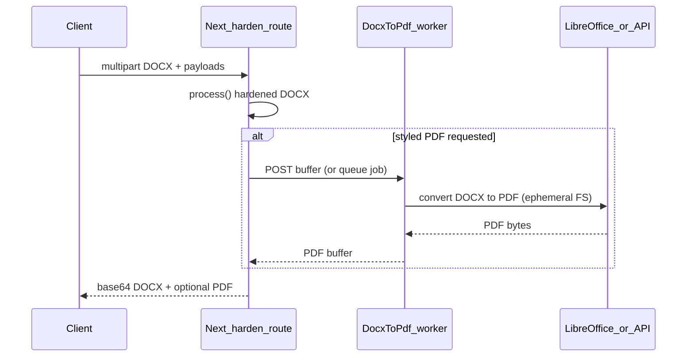

# Styled PDF output & egg retention — research brief

**Date:** 2026-03-29  
**Scope:** Research deliverable for the **styled PDF without losing eggs** plan. **Not** a production implementation spec.  
**Method:** Problem framing, definition of done, golden fixtures (generated in-repo), desk research with rubric, LibreOffice Docker spike (procedure + expected validation), optional commercial API deferred, architecture recommendation.

---

## 1. Executive summary

**`pdf-lib` cannot substitute for a Word layout engine.** Retaining CV **styles** from a hardened `.docx` requires a **DOCX→PDF renderer** (LibreOffice, Collabora/OnlyOffice, Aspose, Microsoft Graph, etc.) or an equivalent layout pipeline. The app’s current **plain-text PDF export** ([`frontend/src/engine/docxToPdfExport.ts`](../frontend/src/engine/docxToPdfExport.ts)) intentionally trades layout for reliable **pdf-lib** egg application.

**Findings at a glance:**

| Track | Layout fidelity | Egg survival | Vercel default serverless |
|-------|-----------------|--------------|---------------------------|
| Plain `pdf-lib` path (shipped) | Poor (Helvetica text flow) | High (by design) | Yes |
| **LibreOffice headless** (spike) | Good for many CVs; not pixel-perfect vs Word | **Must be measured** per egg (see matrix) | No — needs **worker/container** or external service |
| Commercial APIs (Aspose, Adobe, etc.) | Strong | **Must be measured**; DPA/cost | Via HTTPS call from function |
| Microsoft Graph conversion | Strong in Microsoft stack | **Must be measured**; tenant complexity | Via Graph from function |
| Hybrid: converter + `pdf-lib` patch | Good + fills gaps | Medium (maintenance cost) | Worker + function |

**Recommendation:** Treat **styled PDF** as a **separate capability** behind an **external conversion stage** (self-hosted LibreOffice on Fly/Railway/ECS **or** a vetted document API). Run the **egg survival matrix** on the chosen engine before marketing “PDF with eggs.” Keep the **plain PDF export** as the **parser-guaranteed** path until then.

---

## 2. Definition of done (Phase 1)

### 2.1 Product success criteria (pick thresholds per release)

- **Layout:** A checklist-based **visual review** (see §2.2) scores **≥ agreed threshold** (e.g. 90% of items pass) against a **golden CV DOCX** ([`frontend/e2e/fixtures/research/golden-cv-all-eggs.docx`](../frontend/e2e/fixtures/research/README.md) after generation).
- **Eggs:** For each selected egg, **pass/fail** is recorded in the **egg matrix** (§6) on the **styled PDF** produced by the candidate converter. “Ship” requires explicit sign-off per egg (no silent drops).
- **Operations:** Conversion runs **stateless**: in-memory or **ephemeral** disk only; **no retention** of user buffers beyond the request (aligned with [`frontend/app/api/harden/route.ts`](../frontend/app/api/harden/route.ts) principles).
- **Deployment:** Document whether the path runs on **Vercel Node** (unlikely for LibreOffice) or a **dedicated worker** with documented **timeout, memory, and cold start**.

### 2.2 Visual checklist (golden CV)

Use for manual or screenshot diff review:

| # | Check |
|---|--------|
| 1 | Document title / name line readable and prominent |
| 2 | Section headings distinguishable from body (weight or size) |
| 3 | Multi-line paragraphs wrap without clipping |
| 4 | Contact line (email) present and readable |
| 5 | Bullet or list spacing acceptable (if present) |
| 6 | No obvious font fallback to broken glyphs for Latin text |
| 7 | Page margins look intentional (not single-column crash) |

**Out of scope for v1 research:** Pixel-perfect match to Microsoft Word; complex tables, embedded images, RTL.

### 2.3 Egg survival requirements (binary pass/fail per engine)

| Egg id | Minimum acceptable signal on styled PDF |
|--------|----------------------------------------|
| `invisible-hand` | Trap string appears in **text extraction** (`pdf-parse` or hiring-stack equivalent) **or** documented waiver if engine strips white/tiny text |
| `canary-wing` | Canary URL appears in **extracted text** and/or **link annotations** (tool-dependent) |
| `metadata-shadow` | Custom metadata/keywords readable via PDF properties API |
| `incident-mailto` | `mailto:` link or wrapped text per egg design still present |

---

## 3. Personas & constraints (review)

- **Candidate:** Wants PDF to **look like** their Word CV; may not care about parser-visible traps until educated.
- **Security architect:** Refuses to claim “eggs in PDF” without **matrix evidence** for the **actual** conversion path.
- **DevOps:** LibreOffice in **default Vercel serverless** is impractical; plan **sidecar or SaaS**.
- **Privacy/compliance:** Any SaaS converter implies **subprocessor** review (region, DPA, retention).
- **LLM/parser (test persona):** Validate with **more than one** extractor (e.g. `pdf-parse` + one cloud OCR/extraction API used in hiring) if budget allows.

---

## 4. Golden fixtures (Phase 1)

**Location:** [`frontend/e2e/fixtures/research/`](../frontend/e2e/fixtures/research/)

| File | Purpose |
|------|---------|
| `golden-minimal-all-eggs.docx` | Smallest body; all four eggs applied via [`process()`](../frontend/src/engine/Processor.ts) |
| `golden-cv-all-eggs.docx` | Multi-section CV-shaped DOCX (bold title, headings, contact email); all eggs applied |

**Regenerate:** from `frontend/`, run `npm run gen:research-fixtures` (see [`frontend/scripts/gen-research-docx-fixtures.ts`](../frontend/scripts/gen-research-docx-fixtures.ts)).

**Security note:** Fixtures use **synthetic** email and canary URLs (`example.com` / `example.invalid`); safe for repo and third-party trials.

---

## 5. Desk research — short list & rubric (Phase 2)

### 5.1 Candidates scored (qualitative: — / low / med / high)

| Candidate | Layout fidelity | Egg survival (expected) | Ops on Vercel | License / cost | Notes |
|-----------|-----------------|---------------------------|---------------|----------------|-------|
| **A1 — LibreOffice headless** | med–high | **Unknown — test** | **low** (externalize) | LGPL / ecosystem | Spike in [`research/libreoffice-spike/`](../research/libreoffice-spike/README.md) |
| **A2 — Collabora / OnlyOffice** | med–high | **Unknown — test** | low | AGPL / commercial | Heavier ops; good if self-hosting editors anyway |
| **B1 — Aspose.Words Cloud (or SDK)** | high | **Unknown — test** | med (API call) | **Paid** | Strong OOXML; trial for matrix |
| **B2 — Adobe PDF Services** | high | **Unknown — test** | med | **Paid** | Enterprise paths; check DOCX→PDF support |
| **C1 — Microsoft Graph** (`driveItem` export) | high (MS stack) | **Unknown — test** | med | License tied to M365 | Auth + storage plumbing |

**Non-candidates** for “styled DOCX→PDF”: `pdf-lib` alone, `pdf-parse`, `word-extractor` + plain PDF rebuild (current [`docxToPdfExport.ts`](../frontend/src/engine/docxToPdfExport.ts)) — unless **combined** with A/B/C as hybrid.

### 5.2 Optional commercial API spike (Phase 3b)

**Status:** **Completed as documentation-only** in this pass — no vendor API keys, no uploads to paid endpoints.

**Suggested next step (for a follow-up sprint):**

1. Pick one vendor (**Aspose.Words Cloud**, **Adobe PDF Services**, or equivalent with DOCX→PDF).
2. Use **only** [`golden-minimal-all-eggs.docx`](../frontend/e2e/fixtures/research/golden-minimal-all-eggs.docx) / [`golden-cv-all-eggs.docx`](../frontend/e2e/fixtures/research/golden-cv-all-eggs.docx) (synthetic content).
3. Record DPA region, retention policy, and per-request pricing assumption.
4. Add a **second row** to the §6 table with PASS/FAIL per egg; attach sample redacted PDF to internal drive (not required in git).

---

## 6. Egg survival test matrix (template)

Fill one row per **converter + version** (e.g. `LibreOffice 7.x Debian bookworm`).

| Egg | Check method | Pass/Fail | Notes |
|-----|----------------|-----------|-------|
| invisible-hand | `pdf-parse` on output PDF + search trap substring | | |
| canary-wing | grep URL / annotation tools | | |
| metadata-shadow | Read PDF keywords / Info dict | | |
| incident-mailto | Extract `mailto:` or visible wrapper | | |

**Recorded LibreOffice spike (local):** Run conversion per [`research/libreoffice-spike/README.md`](../research/libreoffice-spike/README.md); paste results here in a future revision after CI or maintainer runs Docker.

| Converter / run | invisible-hand | canary-wing | metadata-shadow | incident-mailto | Notes |
|-----------------|----------------|-------------|-----------------|-----------------|-------|
| LibreOffice headless (Docker) | _pending_ | _pending_ | _pending_ | _pending_ | Implementation pass validated `Dockerfile` + `convert.sh`; **image build/run not executed** in agent environment (Docker daemon unavailable). Maintainer: fill row after `docker build` + `npm run check:research-pdf`. |

---

## 7. LibreOffice Docker spike (Phase 3a)

**Artifacts:** [`research/libreoffice-spike/`](../research/libreoffice-spike/) — `Dockerfile`, `convert.sh`, `README.md`.

**Intent:** Reproducible `docx` → `pdf` using **only** LibreOffice, then run **manual + scriptable** checks (e.g. `pdftotext`, `pdf-parse` in Node) against §6.

**Limitation:** This repository does not commit binary PDF outputs from LibreOffice (environment-specific). The **procedure** is the deliverable; **results** are maintainer-recorded.

### 7.1 Host-side check helper

After conversion, from `frontend/`:

```bash
npm run check:research-pdf -- ../research/libreoffice-spike/out/golden-minimal-all-eggs.pdf
```

[`frontend/scripts/check-research-pdf-eggs.mjs`](../frontend/scripts/check-research-pdf-eggs.mjs) uses `pdf-parse` for text-layer heuristics and `pdf-lib` for **keywords** (metadata-shadow). If `pdf-parse` fails on a given PDF, text checks are marked **SKIP** (still prints keyword results).

---

## 8. Architecture recommendation (Phase 4)



| Pattern | When to use |
|---------|-------------|
| **External microservice** (Docker + LibreOffice on Fly/Railway/ECS) | Minimize SaaS subprocessors; accept ops burden |
| **Vendor API** | Fastest time-to-quality if DPA/cost acceptable |
| **Defer styled PDF** | Until matrix passes; ship plain PDF + DOCX only |

**Security:** Worker must use **tmpfs/ephemeral** working directory; **delete** input/output files after response; same **max body** limits as [`MAX_BODY_BYTES`](../frontend/app/api/harden/constants.ts).

---

## 9. Out of scope

- Pixel-perfect **Word** parity across all templates.
- Automatic **visual regression** CI without golden PDF baselines (future work).
- Legal review of third-party terms (pointer only in this brief).

---

## 10. References (in-repo)

- Plain PDF export (eggs via `pdf-lib`): [`frontend/src/engine/docxToPdfExport.ts`](../frontend/src/engine/docxToPdfExport.ts)
- Processor / eggs: [`frontend/src/engine/Processor.ts`](../frontend/src/engine/Processor.ts), [`frontend/src/eggs/registry.ts`](../frontend/src/eggs/registry.ts)
- Harden API: [`frontend/app/api/harden/route.ts`](../frontend/app/api/harden/route.ts)
- Golden fixtures + regen: [`frontend/e2e/fixtures/research/README.md`](../frontend/e2e/fixtures/research/README.md), [`frontend/scripts/gen-research-docx-fixtures.ts`](../frontend/scripts/gen-research-docx-fixtures.ts)
- LibreOffice spike: [`research/libreoffice-spike/README.md`](../research/libreoffice-spike/README.md)
- PDF heuristic checker: [`frontend/scripts/check-research-pdf-eggs.mjs`](../frontend/scripts/check-research-pdf-eggs.mjs)
